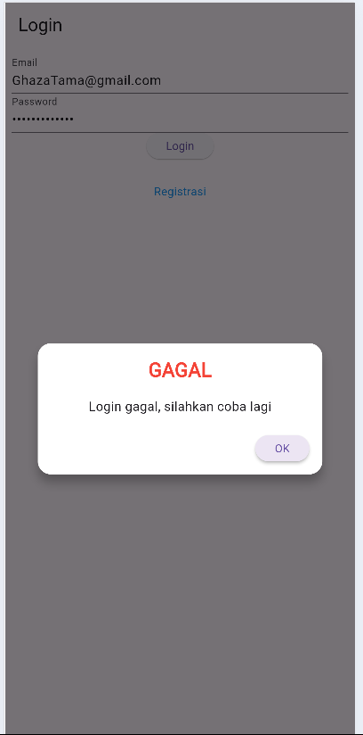

# tokokita


# tugas lima

### Langkah 1: Halaman Login
pertama kali membuka aplikasi langsung diarahkan ke login, jika belum memiliki akun dapat pergi ke halaman registrasi dengan menekan tombol registrasi


### Langkah 2: Halaman Registrasi
Masukkan nama, email, password, dan konfirmasi password, jika sudah maka akun akan terinput ke database


#### Penjelasan: Halaman Registrasi
```
void _submit() {
  _formKey.currentState!.save();
  setState(() {
    _isLoading = true;
  });

  RegistrasiBloc.registrasi(
    nama: _namaTextboxController.text,
    email: _emailTextboxController.text,
    password: _passwordTextboxController.text,
  ).then((value) {
    showDialog(
      context: context,
      barrierDismissible: false,
      builder: (BuildContext context) => SuccessDialog(
        description: "Registrasi berhasil, silahkan login",
        okClick: () {
          Navigator.pop(context);
        },
      ),
    );
  }, onError: (error) {
    showDialog(
      context: context,
      barrierDismissible: false,
      builder: (BuildContext context) => const WarningDialog(
        description: "Registrasi gagal, silahkan coba lagi",
      ),
    );
  });

  setState(() {
    _isLoading = false;
  });
}
```
1. `_formKey.currentState!.save();`: Menyimpan nilai dari form input menggunakan `Form` key.
2. `setState(() { _isLoading = true; });`: Mengubah status menjadi loading sebelum melakukan proses registrasi.
3. `RegistrasiBloc.registrasi(...)`: Memanggil fungsi registrasi untuk mengirim data nama, email, dan password ke backend.
4. `.then((value) {...})`: Menampilkan dialog sukses setelah registrasi berhasil dan memberikan aksi pada tombol "OK".
5. `onError: (error) {...}`: Menampilkan dialog peringatan jika terjadi error selama proses registrasi.
6. `setState(() { _isLoading = false; });`: Mengubah status menjadi tidak loading setelah proses registrasi selesai.

##### Registrasi gagal


##### Registrasi berhasil


### Langkah 3: Halaman Login
Setelah memiliki akun, anda dapat melakukan login


#### Penjelasan: Halaman Login
```
void _submit() {
  _formKey.currentState!.save();
  setState(() {
    _isLoading = true;
  });
  LoginBloc.login(
    email: _emailTextboxController.text,
    password: _passwordTextboxController.text
  ).then((value) async {
    if (value.code == 200) {
      await UserInfo().setToken(value.token.toString());
      await UserInfo().setUserID(int.parse(value.userID.toString()));
      Navigator.pushReplacement(context,
          MaterialPageRoute(builder: (context) => const ProdukPage()));
    } else {
      showDialog(
        context: context,
        barrierDismissible: false,
        builder: (BuildContext context) => const WarningDialog(
          description: "Login gagal, silahkan coba lagi",
        )
      );
    }
  }, onError: (error) {
    print(error);
    showDialog(
      context: context,
      barrierDismissible: false,
      builder: (BuildContext context) => const WarningDialog(
        description: "Login gagal, silahkan coba lagi",
      )
    );
  });
  setState(() {
    _isLoading = false;
  });
}
```

1. `_formKey.currentState!.save();`: Menyimpan nilai input dari form menggunakan `Form` key.
2. `setState(() { _isLoading = true; });`: Mengubah status menjadi loading sebelum proses login dimulai.
3. `LoginBloc.login(...)`: Memanggil fungsi login untuk mengirim email dan password ke backend.
4. `if (value.code == 200) {...}`: Mengecek apakah login berhasil (kode respons 200), dan jika ya, menyimpan token serta user ID, lalu mengarahkan ke halaman produk.
5. `showDialog(...)`: Menampilkan dialog peringatan jika login gagal.
6. `onError: (error) {...}`: Menangani error dari login dengan menampilkan dialog peringatan dan mencetak pesan error.
7. `setState(() { _isLoading = false; });`: Mengubah status menjadi tidak loading setelah proses login selesai.

##### Login Gagal


##### Login Berhasil
saat login berhasil akan masuk ke list produk


### Langkah 4: Halaman List Produk
Anda dapat melihat nama produk dan harga produk, anda juga dapat menambah produk dengan menekan tombol plus diatas dan mengedit produk dengan menekan produk

#### Penjelasan: Halaman List Produk
```
class ItemProduk extends StatelessWidget {
  final Produk produk;

  const ItemProduk({Key? key, required this.produk}) : super(key: key);

  @override
  Widget build(BuildContext context) {
    return GestureDetector(
      onTap: () {
        Navigator.push(
          context,
          MaterialPageRoute(
            builder: (context) => ProdukDetail(
              produk: produk,
            )
          )
        );
      },
      child: Card(
        child: ListTile(
          title: Text(produk.namaProduk!),
          subtitle: Text(produk.hargaProduk.toString()),
        ),
      ),
    );
  }
}
```

1. `final Produk produk;`: Menyimpan data produk yang diterima sebagai parameter untuk digunakan dalam widget.
2. `ItemProduk({Key? key, required this.produk})`: Konstruktor untuk menerima objek produk dan memastikan field produk wajib diisi.
3. `GestureDetector(onTap: () {...})`: Membungkus widget dengan deteksi sentuhan, mengarahkan pengguna ke halaman detail produk saat item di-tap.
4. `Navigator.push(...)`: Mengarahkan ke halaman `ProdukDetail`, mengirim data produk saat item dipilih.
5. `Card(child: ListTile(...))`: Menampilkan produk dalam bentuk kartu, dengan nama produk sebagai judul dan harga sebagai subtitle.

### Langkah 5: Halaman add produk
anda bisa menambahkan kode produk, nama produk dan harganya


anda bisa menekan simpan untuk menyimpan produk anda dan tampilan list produk akan berubah


#### Penjelasan: Halaman add Produk
```
simpan() {
  setState(() {
    _isLoading = true;
  });
  Produk createProduk = Produk(id: null);
  createProduk.kodeProduk = _kodeProdukTextboxController.text;
  createProduk.namaProduk = _namaProdukTextboxController.text;
  createProduk.hargaProduk = int.parse(_hargaProdukTextboxController.text);
  ProdukBloc.addProduk(produk: createProduk).then((value) {
    Navigator.of(context).push(MaterialPageRoute(
        builder: (BuildContext context) => const ProdukPage()));
  }, onError: (error) {
    showDialog(
      context: context,
      builder: (BuildContext context) => const WarningDialog(
        description: "Simpan gagal, silahkan coba lagi",
      )
    );
  });
  setState(() {
    _isLoading = false;
  });
}
```

1. `setState(() { _isLoading = true; });`: Mengubah status menjadi loading sebelum proses penyimpanan dimulai.
2. `Produk createProduk = Produk(id: null);`: Membuat objek produk baru dengan nilai `id` kosong (belum diisi).
3. `createProduk.kodeProduk = _kodeProdukTextboxController.text;`: Mengisi properti `kodeProduk` dari input pengguna.
4. `createProduk.namaProduk = _namaProdukTextboxController.text;`: Mengisi properti `namaProduk` dari input pengguna.
5. `createProduk.hargaProduk = int.parse(_hargaProdukTextboxController.text);`: Mengisi properti `hargaProduk` dari input pengguna dengan nilai yang diubah menjadi integer.
6. `ProdukBloc.addProduk(produk: createProduk).then((value) {...})`: Mengirim produk baru ke backend untuk ditambahkan, dan jika berhasil, mengarahkan pengguna ke halaman produk.
7. `onError: (error) {...}`: Menampilkan dialog peringatan jika terjadi kesalahan dalam proses penyimpanan.
8. `setState(() { _isLoading = false; });`: Mengubah status menjadi tidak loading setelah proses penyimpanan selesai.

### Langkah 6: Halaman detail produk
anda dapat melihat detail produk dengan menekan produk pada list produk, didalam halaman detail produk menampilkan kode, nama dan harga produk serta tombol edit dan delete


#### Penjelasan: Halaman detail Produk
```
class ProdukDetail extends StatefulWidget {
  Produk? produk;

  ProdukDetail({Key? key, this.produk}) : super(key: key);

  @override
  _ProdukDetailState createState() => _ProdukDetailState();
}

class _ProdukDetailState extends State<ProdukDetail> {
  @override
  Widget build(BuildContext context) {
    return Scaffold(
      appBar: AppBar(
        title: const Text('Detail Produk'),
      ),
      body: Center(
        child: Column(
          children: [
            Text(
              "Kode : ${widget.produk!.kodeProduk}",
              style: const TextStyle(fontSize: 20.0),
            ),
            Text(
              "Nama : ${widget.produk!.namaProduk}",
              style: const TextStyle(fontSize: 18.0),
            ),
            Text(
              "Harga : Rp. ${widget.produk!.hargaProduk.toString()}",
              style: const TextStyle(fontSize: 18.0),
            ),
            _tombolHapusEdit()
          ],
        ),
      ),
    );
  }
}
```

1. `Produk? produk;`: Mendefinisikan objek produk yang mungkin null, diterima melalui konstruktor.
2. `ProdukDetail({Key? key, this.produk})`: Konstruktor untuk menerima objek produk opsional yang akan ditampilkan dalam halaman detail.
3. `Scaffold(...)`: Membuat struktur halaman dengan `AppBar` dan konten utama berupa detail produk.
4. `Text("Kode : ${widget.produk!.kodeProduk}", ...)`: Menampilkan teks yang berisi kode produk dari objek produk.
5. `Text("Nama : ${widget.produk!.namaProduk}", ...)`: Menampilkan teks yang berisi nama produk dari objek produk.
6. `Text("Harga : Rp. ${widget.produk!.hargaProduk.toString()}", ...)`: Menampilkan harga produk dalam format teks dengan nilai mata uang rupiah.
7. `_tombolHapusEdit()`: Menyertakan tombol untuk menghapus atau mengedit produk (meskipun implementasi tombol tidak ditampilkan dalam kode).

### Langkah 7: Halaman ubah produk
anda dapat mengubah kode, nama maupun harga produk


setelah mengisi anda dapat menekan tombol ubah untuk mengubah detail produk

#### Penjelasan: Halaman ubah Produk
```
ubah() {
  setState(() {
    _isLoading = true;
  });
  Produk updateProduk = Produk(id: widget.produk!.id!);
  updateProduk.kodeProduk = _kodeProdukTextboxController.text;
  updateProduk.namaProduk = _namaProdukTextboxController.text;
  updateProduk.hargaProduk = int.parse(_hargaProdukTextboxController.text);
  ProdukBloc.updateProduk(produk: updateProduk).then((value) {
    Navigator.of(context).push(MaterialPageRoute(
        builder: (BuildContext context) => const ProdukPage()));
  }, onError: (error) {
    showDialog(
      context: context,
      builder: (BuildContext context) => const WarningDialog(
        description: "Permintaan ubah data gagal, silahkan coba lagi",
      )
    );
  });
  setState(() {
    _isLoading = false;
  });
}
```

1. `setState(() { _isLoading = true; });` - Menandai bahwa proses loading dimulai dengan mengubah status `_isLoading` menjadi `true`.
2. `Produk updateProduk = Produk(id: widget.produk!.id!);` - Membuat objek `Produk` baru dengan ID produk dari widget yang diteruskan.
3. `updateProduk.kodeProduk = _kodeProdukTextboxController.text;` - Memperbarui kode produk dengan nilai yang dimasukkan di field teks.
4. `updateProduk.namaProduk = _namaProdukTextboxController.text;` - Memperbarui nama produk dengan nilai yang dimasukkan di field teks.
5. `updateProduk.hargaProduk = int.parse(_hargaProdukTextboxController.text);` - Memperbarui harga produk dengan mengonversi nilai dari field teks menjadi integer.
6. `ProdukBloc.updateProduk(produk: updateProduk).then((value) {...})` - Mengirim permintaan untuk memperbarui data produk dan menjalankan aksi jika berhasil.
7. `Navigator.of(context).push(MaterialPageRoute(...))` - Mengarahkan pengguna ke halaman `ProdukPage` setelah proses berhasil.
8. `onError: (error) {...}` - Menangani kesalahan jika permintaan pembaruan data gagal dengan menampilkan dialog peringatan.
9. `setState(() { _isLoading = false; });` - Menandai bahwa proses loading selesai dengan mengubah status `_isLoading` menjadi `false`.

### Langkah 8: delete produk
anda dapat menghapus produk dengan menekan tombol delete dan menekan pop up yaa


setelah menekan yaa produk akan terhapus pada list produk


#### Penjelasan: Delete Produk
```
void confirmHapus() {
  AlertDialog alertDialog = AlertDialog(
    content: const Text("Yakin ingin menghapus data ini?"),
    actions: [
      OutlinedButton(
        child: const Text("Ya"),
        onPressed: () {
          ProdukBloc.deleteProduk(id: int.parse(widget.produk!.id!)).then(
            (value) => {
              Navigator.of(context).push(MaterialPageRoute(
                  builder: (context) => const ProdukPage()))
            }, onError: (error) {
            showDialog(
              context: context,
              builder: (BuildContext context) => const WarningDialog(
                description: "Hapus gagal, silahkan coba lagi",
              )
            );
          });
        },
      ),
      OutlinedButton(
        child: const Text("Batal"),
        onPressed: () => Navigator.pop(context),
      )
    ],
  );
  showDialog(builder: (context) => alertDialog, context: context);
}
```

1. `AlertDialog alertDialog = AlertDialog(...)` - Membuat dialog konfirmasi dengan pesan dan pilihan aksi.
2. `const Text("Yakin ingin menghapus data ini?")` - Menampilkan teks konfirmasi yang menanyakan apakah pengguna yakin ingin menghapus data.
3. `OutlinedButton(... onPressed: () {...})` - Menyediakan tombol "Ya" yang akan menjalankan aksi penghapusan data saat ditekan.
4. `ProdukBloc.deleteProduk(id: int.parse(widget.produk!.id!)).then(...)` - Mengirim permintaan untuk menghapus produk berdasarkan ID produk.
5. `Navigator.of(context).push(MaterialPageRoute(...))` - Mengarahkan pengguna kembali ke halaman `ProdukPage` setelah penghapusan berhasil.
6. `onError: (error) {...}` - Menangani kesalahan jika penghapusan gagal dengan menampilkan dialog peringatan.
7. `OutlinedButton(... onPressed: () => Navigator.pop(context))` - Menyediakan tombol "Batal" untuk menutup dialog tanpa melakukan aksi.
8. `showDialog(builder: (context) => alertDialog, context: context)` - Menampilkan dialog konfirmasi penghapusan di layar.